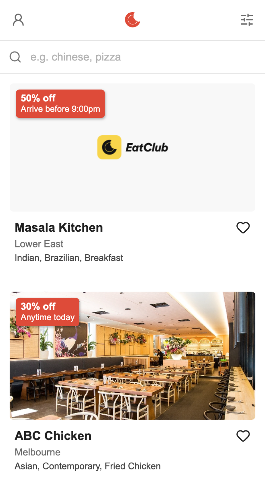
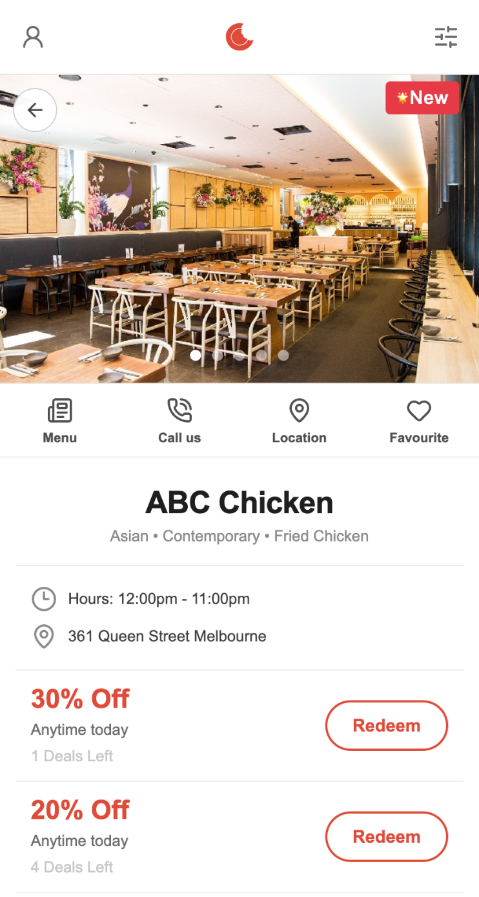

# EatClub Frontend Challenge

## About
A small React app built as part of the EatClub frontend technical challenge.  It displays a list of restaurants fetched from a JSON API, allows users to  search by name or cuisine, and navigate through to a detail page showing  deals, hours, and location.

## Screenshots

| List | Detail |
|------|--------|
|  |  |

## Tech Stack
- **Vite** - modern build tool, chosen over Create React App which is deprecated
- **React Router** - handles client-side navigation between the list and detail screens
- **TypeScript** - adds type safety, catches errors at write-time rather than runtime
- **lucide-react** - lightweight SVG icon library with built-in TypeScript support

## Getting Started
```bash
git clone https://github.com/donnaelise/eatclub-challenge
cd eatclub-challenge
npm install
npm run dev
```

## Decisions & Trade-offs
- Using useLocation state to pass restaurant data instead of fetching again on the detail page - and the known limitation that direct URL navigation won't work
- Configured a Vite dev proxy to handle CORS restrictions when fetching from the external API
- Omitted dine-in/takeaway indicators as the API doesn't provide reliable data to support this
- Separated API fetching (`services/api.ts`) from React state management (`useRestaurants` hook) to keep concerns separate and make the fetch logic reusable
- Sorting happens on every render. With a larger dataset I'd use useMemo to cache it
- Added an explicit back button on the detail screen as this is running in a browser rather than a native app, making the navigation behaviour visible

## Given more time I would...
- Add time-based deal logic
- Check current location and calculate distance to restaurant
- Add tests for core logic (sorting, filtering, the custom hook)
- Implement the useLocation state limitation fix — fall back to fetching by ID if user navigates directly to a restaurant URL